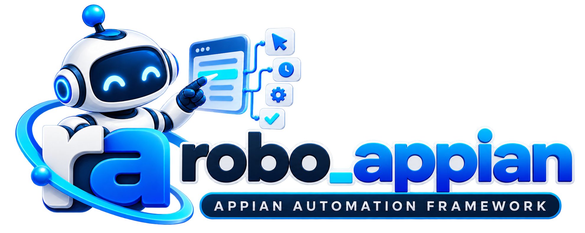

---
hide:
  - navigation
  - toc
---

  <section class="ra-target-hero">
    

      

        ◉ Open Source
        Python Automation Framework for Appian
      

      <h1>Automate Appian. <em>Faster. Reliably.</em></h1>
      
A reusable Python automation framework for Appian UI automation and testing. Built for readable interactions, stable component reuse, and real-world enterprise test suites.

      

        <a class="ra-target-btn primary" href="getting-started/installation/">🚀&nbsp; Get Started →</a>
        <a class="ra-target-btn" href="https://github.com/dinilmithra/robo-appian">◉&nbsp; View on GitHub ↗</a>
      

      
pip<code>pip install robo-appian</code>

    

    

      
      
<b>▶</b>Automate Workflows

      
<b>✓</b>Test Processes

      
<b>▥</b>Ensure Quality

      
<b>⚙</b>Reusable Utilities

      
<b>▥</b>Pytest Ready

      
<b>∞</b>CI/CD Friendly

      
<b>▥</b>Scalable

    

  </section>

  <section class="ra-target-features" aria-label="robo-appian framework capabilities">
    <article>◇
<strong>Reusable Utilities</strong>
Common Appian actions, components, and helpers ready to use.

</article>
    <article>◎
<strong>Stable Selectors</strong>
Readable, label-oriented locators for Appian UI elements.

</article>
    <article>▤
<strong>Pytest Ready</strong>
Works cleanly with pytest fixtures, assertions, and test projects.

</article>
    <article>ϟ
<strong>Parallel Friendly</strong>
Designed to work with isolated workers and parallel execution.

</article>
    <article>∞
<strong>CI/CD Friendly</strong>
Fits Jenkins and modern CI/CD automation pipelines.

</article>
    <article>▥
<strong>Clear Diagnostics</strong>
Playwright-native behavior works with logs, screenshots, and reports.

</article>
  </section>

  <section class="ra-target-workbench">
    

      
›_ &nbsp; Quick Start🐍 Python

      <pre><code>1 from robo_automation import AppianPage
2
3 def test_user_options(page: AppianPage):
4     user_options = page.get_by_attributes(
5         attributes={"role": "button", "aria-label": "User options"},
6         excat_match=True,
7     )
8     user_options.to_be_visible()
9     user_options.click()</code></pre>
    

    

      
♟ &nbsp; Architecture Overview<a href="getting-started/concepts/">How it works&nbsp; →</a>

      

        
▤<strong>Test Cases</strong><small>• Pytest tests • Page objects • Custom workflows</small>

        <b>→</b>
        

<strong>robo-appian</strong><small>Appian Component Layer</small>
<ul><li>Appian components</li><li>Label-oriented interactions</li><li>Reusable Appian utilities</li><li>Browser install CLI</li><li>Built on robo-automation</li></ul>

        <b>→</b>
        
▣<strong>robo-automation + Playwright</strong><small>• Generic fixtures • Robo* wrappers • Browser engine</small>

      

    

  </section>

  <section class="ra-target-docs">
    
<h2>▣ &nbsp; Documentation</h2><a href="getting-started/installation/">Explore all docs&nbsp; →</a>

    

      <a href="getting-started/installation/">↓
<strong>Installation</strong><small>Set up robo-appian in minutes.</small>
<b>→</b></a>
      <a href="getting-started/concepts/">⚙
<strong>Core Concepts</strong><small>Understand scopes and reusable interactions.</small>
<b>→</b></a>
      <a href="api/">&lt;/&gt;
<strong>Core APIs</strong><small>Browse Appian components and utilities.</small>
<b>→</b></a>
      <a href="getting-started/quick-start/">▧
<strong>Examples</strong><small>Ready-to-use automation patterns.</small>
<b>→</b></a>
      <a href="guides/components/">●
<strong>Best Practices</strong><small>Choose the right component for the control.</small>
<b>→</b></a>
      <a href="getting-started/troubleshooting/">◉
<strong>Troubleshooting</strong><small>Common issues and practical solutions.</small>
<b>→</b></a>
    

  </section>

